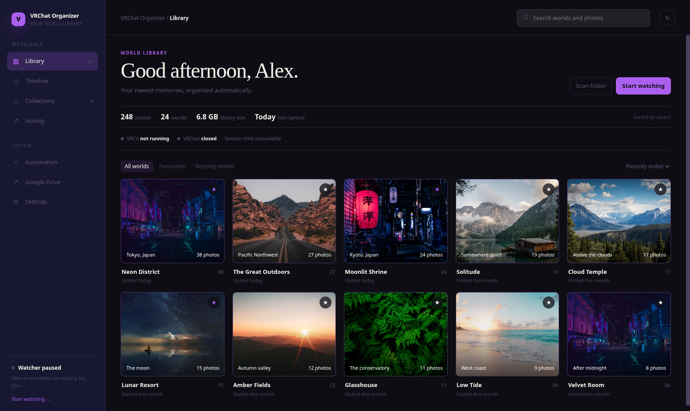

# VRChat Screenshot Organizer

> Automatically organize your VRChat screenshots by world while maintaining your year/month folder structure

The actively maintained desktop application is the Rust/Tauri implementation in
[`rust-rewrite/`](./rust-rewrite/). It provides the Linux-first GUI, CLI,
watch mode, undo support and AppImage packaging documented there.

[](https://opensource.org/licenses/MIT)
[](https://www.rust-lang.org/)
[](https://v2.tauri.app/)
[](https://github.com/Seventh-Void/VRChat-Screenshot-Organizer/releases)

> **Version 2.1.0** — the current Rust/Tauri desktop release.



## 🎯 Features

- ✨ **Automatic World Detection** — Reads world metadata from VRChat screenshot EXIF/PNG text chunks
- 📁 **Smart Organization** — Creates world-named subfolders within each month folder
- 🔄 **Undo Support** — Every move is logged to `.vrchat-organizer-undo.json` for easy one-click reversal
- 🎨 **Print Handling** — Automatically separates 2048×1440 prints into a dedicated "Prints" folder
- 📅 **Bulk or Selective Scanning** — Organize the latest month, all historical months, or a single folder
- 🖥️ **Tauri Desktop GUI** — Beautiful dark-themed desktop app with real-time activity feed
- 🕵️ **Watch Mode** — Automatically organize new screenshots as they're taken using filesystem events + polling (Steam Proton/Wine compatible)
- 📊 **Per-World Statistics** — Track how many photos per world are organized
- ⚡ **Pure Rust** — Fast, memory-safe, no Python or external runtime required
- 📦 **Release-ready packaging** — AppImage for Linux plus portable and installer builds for Windows

## 📋 Requirements

- **[VRCX](https://github.com/vrcx-team/VRCX)** installed and running
  - Required to embed world metadata in screenshots
  - Must enable **"Screenshot Metadata"** in VRCX settings
  - Must be running in background for metadata to be embedded at screenshot time

### ⚠️ Important: VRCX Setup Required

This tool reads world metadata that **VRCX embeds into your screenshots**. Without VRCX:

1. **No metadata embedded** → screenshots won't be organized
2. **VRCX must be running** → for proper metadata embedding
3. **Enable in settings** → Go to VRCX Settings → Enable "Screenshot Metadata"

If you see "No world metadata found" messages, verify VRCX is running and Screenshot Metadata is enabled.

### Building from Source Requirements

- [Rust](https://rustup.rs/) (edition 2021, minimum rustc 1.77.2+)
- For the Tauri GUI: system WebKit2GTK libraries (see [Tauri prerequisites](https://v2.tauri.app/start/prerequisites/))

## 🤖 AI NOTICE & DISCLAIMER

This project has been developed with assistance from an AI coding tool. While the AI helped generate code and documentation, it may still have bugs, edge cases, or inaccuracies.

**RUN AT YOUR OWN RISK!** This tool modifies your file system by moving files.

### Always Do This Before Running:

1. **Use Settings → Preview organization or CLI `VRCHAT_DRY_RUN` first** — preview changes without moving any files
2. **Create a backup:**
   - Backup your entire VRChat pictures folder before running
   - Or backup at least the month folders you're organizing
   - Better safe than sorry!
3. **Review the output carefully.** If you don't like what you see, **do not proceed**.

**The author assumes **no responsibility for data loss**. Use at your own risk.**

## 🚀 Quick Start

### Download

Download the latest version from the [releases page](https://github.com/Seventh-Void/VRChat-Screenshot-Organizer/releases).
The v2.1.0 release includes:

- `VRChatOrganizer-2.1.0-x86_64.AppImage` — Linux x86_64 Tauri GUI bundle
- `VRChatOrganizer-2.1.0-windows-x86_64.exe` — Windows x86_64 CLI build
- Native Windows Tauri portable and installer builds produced by GitHub Actions
- `SHA256SUMS` and the release README

### Linux installation

The AppImage contains the application and release assets. Install the Tauri
Linux runtime libraries listed in the build requirements before launching it:

```bash
chmod +x VRChatOrganizer-2.1.0-x86_64.AppImage
./VRChatOrganizer-2.1.0-x86_64.AppImage
```

On Debian/Ubuntu, the required WebKitGTK/GTK packages are the same packages
listed in the CI workflow. Other distributions should install their equivalent
WebKitGTK 4.1, GTK 3, libayatana-appindicator, librsvg, libsoup 3, and
JavaScriptCore GTK packages.

For desktop integration, copy the AppImage to a permanent location and use the
desktop entry installed by your distribution's AppImage manager. The package
contains the application icon, desktop entry, and AppStream metadata.

### Windows installation

Use the native Windows Tauri NSIS installer for a normal Start Menu installation,
or use the portable Tauri executable when you do not want to install anything.
The separately provided `VRChatOrganizer-2.1.0-windows-x86_64.exe` is the
headless CLI build and does not provide the GUI. Windows 10/11 includes WebView2
on supported systems; if a GUI build reports a missing WebView2 runtime, install it from Microsoft's
[WebView2 page](https://developer.microsoft.com/microsoft-edge/webview2/).

### Before You Start

1. **Install VRCX**: Download from [github.com/vrcx-team/VRCX](https://github.com/vrcx-team/VRCX)
2. **Enable Screenshot Metadata**: In VRCX Settings → Media → Enable "Screenshot Metadata"
3. **Keep VRCX Running** — metadata is embedded at screenshot time

### Using the Tauri Desktop GUI (Recommended)

```bash
# Make the AppImage executable
chmod +x VRChatOrganizer-2.1.0-x86_64.AppImage

# Launch the desktop app
./VRChatOrganizer-2.1.0-x86_64.AppImage
```

The GUI provides:
- **Folder picker** — Browse or auto-detect your VRChat screenshots folder
- **Scan folder** — Scan and organize the selected screenshot folder
- **Start watching** — Continuously monitor the folder and auto-organize new screenshots
- **Undo** — Revert the last organization with a single click
- **Activity Log** — Real-time event feed showing every action taken
- **All worlds / All images** — Real world groups require a genuine world name
  and at least two photos; every other photo remains available in the
  thumbnail-based All images view
- **Current session** — Shows only screenshots captured since the current
  VRChat process started. Organizer switches to this tab when VRChat opens,
  including when VRChat was already running at startup
- **World photo viewer** — Open any photo, navigate within the current view,
  inspect capture/player details, copy its path, or open its folder
- **Settings** — Preview an organization run and configure the selected folder
- **First-run onboarding** — Set your display name, confirm the screenshot folder, and review the file-change warning before the first scan

### Using the CLI Tool

```bash
# Build the CLI binary
cd rust-rewrite
cargo build -p desktop --release

# Dry run — preview what will happen (no actual changes)
VRCHAT_DRY_RUN=1 ./target/release/desktop ~/Pictures/VRChat/VRChat

# Run organization on your VRChat screenshots folder
./target/release/desktop ~/Pictures/VRChat/VRChat

# Scan all historical month folders, not just the latest
VRCHAT_SCAN_ALL_MONTHS=1 ./target/release/desktop ~/Pictures/VRChat/VRChat

# Treat the path as a single folder (no YYYY-MM structure)
VRCHAT_SINGLE_FOLDER=1 ./target/release/desktop ~/Pictures/VRChat/Screenshots
```

### Building from Source

```bash
# Clone the repository
git clone https://github.com/Seventh-Void/VRChat-Screenshot-Organizer
cd VRChat-Screenshot-Organizer/rust-rewrite

# Build the desktop CLI tool
cargo build -p desktop --release

# Or build the Tauri desktop GUI app
cargo build -p app --release

# Build the full workspace (all crates)
cargo build --release

# Build the versioned Linux AppImage release asset (requires appimagetool)
./build-appimage.sh

# Build the versioned Windows CLI release asset from Linux (requires mingw-w64)
# See BUILDING_WINDOWS.md for detailed instructions
./build-windows.sh
```

The scripts write release assets to `../release/v2.1.0/`:
`VRChatOrganizer-2.1.0-x86_64.AppImage`, the Windows CLI executable, and
`SHA256SUMS`. The native Windows GUI, portable executable, NSIS installer, and
MSI are built on the Windows GitHub Actions runner because Tauri uses the native
Windows WebView2 toolchain.

## 📖 Usage Guide

### CLI Usage

The CLI is configured exclusively via **environment variables** (no CLI flags):

```bash
# Organize the latest month folder
./desktop ~/Pictures/VRChat/VRChat

# Dry run — show what would happen without moving files
VRCHAT_DRY_RUN=1 ./desktop ~/Pictures/VRChat/VRChat

# Scan all historical month folders at once
VRCHAT_SCAN_ALL_MONTHS=1 ./desktop ~/Pictures/VRChat/VRChat

# Treat the provided path as a single flat folder (no YYYY-MM structure expected)
VRCHAT_SINGLE_FOLDER=1 ./desktop ~/Pictures/VRChat/SomeFolder
```

#### Environment Variables

| Variable | Description |
|---|---|
| `VRCHAT_DRY_RUN` | Set to any value to enable dry-run mode (preview only, no changes) |
| `VRCHAT_SCAN_ALL_MONTHS` | Set to any value to scan all `YYYY-MM` subfolders instead of just the latest |
| `VRCHAT_SINGLE_FOLDER` | Set to any value to treat the input path as a single folder to organize |

### Tauri GUI Usage

The GUI is a full-featured desktop application built with Tauri v2. On launch you'll see a disclaimer modal asking you to confirm you have backups before proceeding.

**Desktop GUI:**
1. Select or auto-detect your VRChat screenshots folder
2. Click **Scan folder** to organize all screenshots, or **Start watching** to continuously monitor
3. View organized worlds and photo counts in the grid
4. Click **Undo** to revert the last organization

Use **Scan all months** in Automation or **Preview organization** in Settings
when you need a historical scan or a no-write preview. The desktop GUI currently
uses the default `{world}` organization template and the standard year/month
folder layout; custom templates and single-folder mode are available through the
CLI environment/configuration path.

### Folder Structure

Before organizing:
```
VRChat/
├── 2025-01/
│   ├── VRChat_2025-01-12_12-34-56.xyz_1920x1080.png
│   ├── VRChat_2025-01-12_13-00-00.xyz_1920x1080.png
│   ├── VRChat_2025-01-13_10-00-00.xyz_2048x1440.png
│   └── ...
├── 2025-02/
│   └── ...
```

After organizing:
```
VRChat/
├── 2025-01/
│   ├── Black Cat/
│   │   ├── VRChat_2025-01-12_12-34-56.xyz_1920x1080.png
│   │   └── VRChat_2025-01-12_13-00-00.xyz_1920x1080.png
│   ├── Prints/
│   │   └── VRChat_2025-01-13_10-00-00.xyz_2048x1440.png
│   └── ...
├── 2025-02/
│   └── ...
└── .vrchat-organizer-undo.json    # Undo log (created on first run)
```

### Template Variables (CLI/configuration only)

The template field lets you customize the subfolder naming pattern using these variables:

| Variable | Description | Example |
|---|---|---|
| `{world}` | VRChat world name | `Black Cat` |
| `{year}` | Screenshot year | `2025` |
| `{month}` | Screenshot month (zero-padded) | `01` |
| `{day}` | Screenshot day (zero-padded) | `12` |
| `{width}` | Image width in pixels | `1920` |
| `{height}` | Image height in pixels | `1080` |

Default template: `{world}`

## 🛡️ Undo System

Every file move is logged to a `.vrchat-organizer-undo.json` file in the screenshots folder root. This enables:

- **One-click undo** via the GUI **Undo** button
- The undo log is cleared after a successful undo
- If a file has been manually moved or deleted since organization, it's skipped gracefully

## 🕵️ Watch Mode (GUI Only)

The **Watch** feature uses a combination of OS filesystem events (`inotify` on Linux) and periodic polling to detect new screenshots:

- **Initial scan** — All existing unorganized files are processed when watch starts
- **Real-time events** — New files are detected as they're created
- **Fallback polling** — About every 30 seconds scans for missed files (handles Steam Proton/Wine where events may not fire)
- **Per-file organization** — Each new screenshot is organized individually into its correct `YYYY-MM` folder based on the date in the filename
- **Live counters** — Track organized and total processed files in real-time

## 🐛 Troubleshooting

### ⚠️ Critical: VRCX Not Running or Metadata Disabled
**Symptom**: All screenshots show "No world metadata found"
- **Solution 1**: Ensure VRCX is installed from [github.com/vrcx-team/VRCX](https://github.com/vrcx-team/VRCX)
- **Solution 2**: Open VRCX Settings → Enable "Screenshot Metadata" checkbox
- **Solution 3**: Make sure VRCX is running in the background while taking screenshots

### "No world metadata found"
- Verify VRCX is running and Screenshot Metadata is enabled (see above)
- Some old screenshots taken before VRCX setup won't have metadata embedded
- These images will remain in the month folder root
- To inspect an image's metadata manually, use: `exiftool screenshot.png` or `pngcheck -7 screenshot.png`

### Permission denied errors
- Ensure you have read/write permissions on the VRChat pictures directory
- Make the AppImage executable: `chmod +x VRChatOrganizer-2.1.0-x86_64.AppImage`

### Tauri GUI shows a blank/black window
- Ensure WebKit2GTK is installed on your system (see [Tauri prerequisites](https://v2.tauri.app/start/prerequisites/))
- Try running from terminal to see error output

## 📁 Project Structure

```
VRChat-Screenshot-Organizer/
├── rust-rewrite/                    # Rust workspace (main codebase)
│   ├── Cargo.toml                   # Workspace manifest
│   ├── build-appimage.sh            # AppImage packaging script
│   ├── build-windows.sh             # Windows cross-compilation script
│   ├── BUILDING_WINDOWS.md          # Windows build instructions
│   ├── crates/
│   │   ├── organizer-core/          # Core library: metadata extraction + file organization
│   │   │   ├── Cargo.toml
│   │   │   └── src/
│   │   │       └── lib.rs           # Image metadata extraction, file organization, undo system
│   │   └── desktop/                 # CLI binary entrypoint
│   │       ├── Cargo.toml
│   │       └── src/
│   │           └── main.rs          # CLI: env-var-based configuration
│   ├── frontend/                    # Tauri HTML/CSS/JavaScript frontend
│   ├── packaging/                   # Linux desktop entry and AppStream metadata
│   ├── src-tauri/                   # Tauri v2 desktop app shell
│   │   ├── Cargo.toml
│   │   ├── tauri.conf.json          # Tauri configuration
│   │   ├── icons/                   # Application icons
│   │   ├── src/
│   │   │   ├── main.rs              # Tauri entrypoint
│   │   │   └── lib.rs               # Tauri commands: organize, undo, watch, auto-detect
│   │   └── capabilities/
│   │       └── default.json
│   └── README.md                    # Rust-specific details
├── release/v2.1.0/                  # Local release staging area (ignored binaries)
├── docs/screenshots/                # Documentation screenshots
├── README.md                        # This file
├── CONTRIBUTING.md
├── LICENSE                          # MIT License
```

## 🔧 Technical Details

### How Metadata Extraction Works

Metadata (world name, software) is extracted **without any external dependencies**:

- **JPEG files** — Uses `kamadak-exif` to read EXIF tags:
  - Tag 270 (ImageDescription) — JSON containing `{"world": {"name": "..."}}`
  - Tag 305 (Software) — Creator software name
- **PNG files** — Manually parses PNG text chunks at the byte level:
  - `tEXt`, `zTXt` (zlib-compressed), `iTXt` (UTF-8) chunks
  - Keywords: `Description`, `Comment` — JSON containing world metadata
  - Keywords: `Software`, `Creator Tool` — software name
- **WebP** — Dimensions only (no EXIF/text chunk metadata supported yet)

### Key Dependencies

| Crate | Purpose |
|---|---|
| `kamadak-exif` | EXIF data reader for JPEG files |
| `image` | Image decoding and dimension reading |
| `flate2` | zlib decompression for PNG zTXt/iTXt chunks |
| `serde` / `serde_json` | JSON parsing for world metadata |
| `chrono` | Date handling for filename-based date extraction |
| `regex` / `walkdir` | File scanning and pattern matching |
| `tauri` v2 | Desktop application framework |
| `notify` | OS filesystem event watcher |

## 🤝 Contributing

Contributions are welcome! Please see [CONTRIBUTING.md](CONTRIBUTING.md) for guidelines.

## 📄 License

This project is licensed under the MIT License - see [LICENSE](LICENSE) for details.

## ⚠️ Final Disclaimer

This tool modifies your file system by moving your screenshot files. **Use at your own risk!**

**Critical Safety Steps:**
- ✅ **Always preview first** — Use the GUI's **Dry Run** option (advanced mode) or set `VRCHAT_DRY_RUN=1` in the CLI
- ✅ **Always backup before running** — Keep copies of your important screenshots
- ✅ **Review output carefully** — Make sure you agree with what it will do
- ✅ **Use the Undo button** if something goes wrong
- ✅ **Only run if you're comfortable** — Don't proceed if you have doubts

**The author assumes NO responsibility for data loss or damage.** This is provided as-is. While the tool is designed to be safe and careful, **you use it at your own risk.**

## 🙏 Acknowledgments

- [image-rs](https://github.com/image-rs/image) — Rust Imaging Library
- [kamadak-exif](https://github.com/kamadak/exif-rs) — Rust EXIF Reader
- [VRCX](https://github.com/vrcx-team/VRCX) — VRChat Companion
- [Tauri](https://tauri.app/) — Desktop Application Framework
- [notify](https://github.com/notify-rs/notify) — Filesystem event notifications
- VRChat Community

## 📞 Support

For issues, questions, or suggestions:
- Open an [issue](../../issues) on GitHub

- **The AppImage does not start:** make it executable with `chmod +x`, then run
  it from a terminal to see diagnostics. On older distributions, update the
  graphics/WebKit packages or use the portable Windows build.
- **Windows shows a WebView2 error:** install or repair the Evergreen WebView2
  Runtime, then restart the application.
- **No world metadata is found:** VRCX must be running while screenshots are
  taken, and its Screenshot Metadata option must be enabled.
- **Permission denied:** choose a folder you can write to and keep a backup
  before organizing. Use Dry Run before the first real operation.

---

**Made with ❤️ for the VRChat community**
